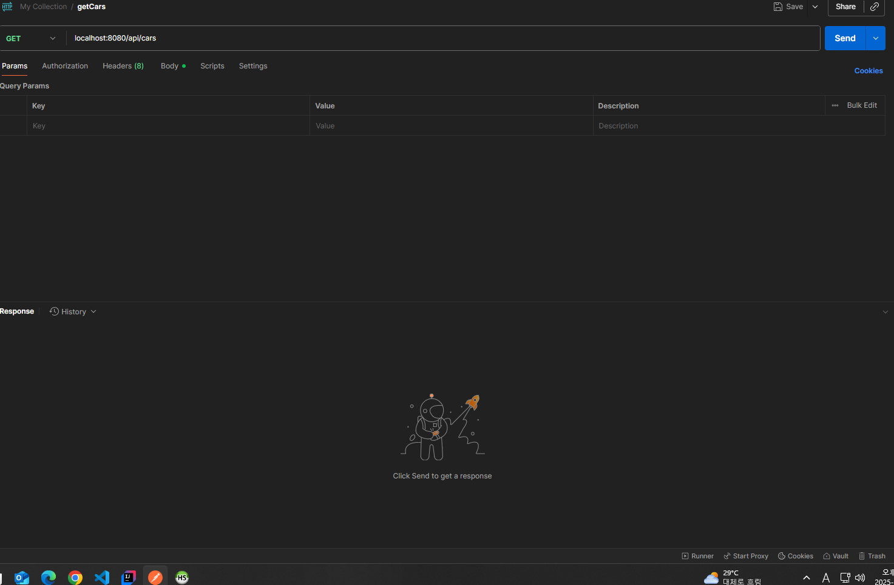
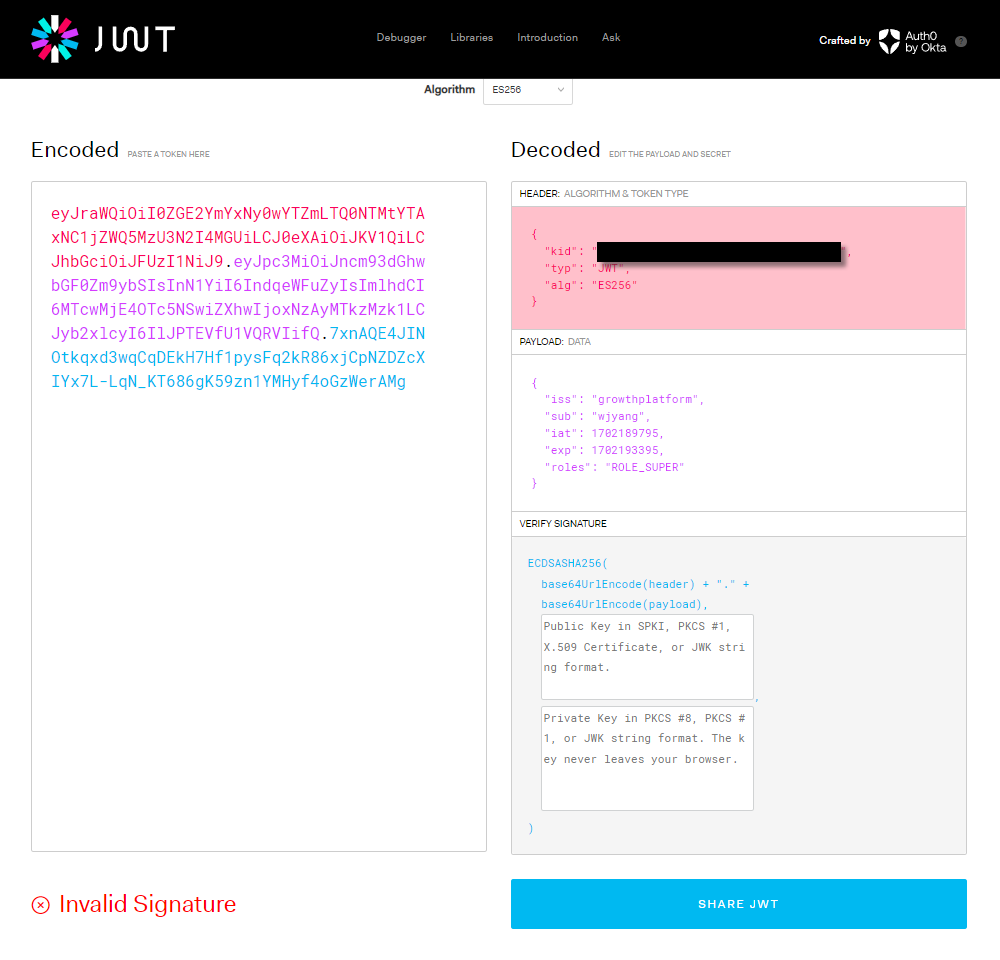

1. RESTful API 문서화 - 여기까지 cardatabase # 1
2. 백엔드 보호 - cardatabase # 2 만들어서 할거다.
백엔드-프론트엔드 연결 예정

# RESTful API 문서화
- RESTful API는 이를 이용하는 개발자가 그 기능과 작동을 이해할 수 있도록 적절하게 문서화 되야 한다.
- 내가 개발하는데 왜 문서가 필요하냐고 하면 안된다.
- 이번엔 Open API 3 를 이용하여 이용할 수 있는 엔드포인트 목록 / 허용되는 데이터 양식 / API와 상호작용하는 방법 등을 포함시킬 예정.

OpenAPI3를 이용한 자동 문서 생성 방식(이전엔 Swagger 명세라고 했다.)인데 이는 RESTful API 를 위한 API 설명 명세서에 해당함. RAML도 있긴한데 한국에선 잘 안쓰는거같다.

OpenAPI도 라이브러리다.
1. SpringDoc OpenAPI Starter WebMVC UI » 3.0.0-M1
`implementation 'org.springdoc:springdoc-openapi-starter-webmvc-ui:2.0.2'`

이제 알아야 될 점은 '외부 라이브러리'를 사용한다면 Java 자체를 이용하는 것이 아니기 때문에 _의존성 추가_ 가 선행돼야 한다는 점이다.
그럼 의존성 추가는 어디서? -> build.gradle에서 함. -> 여기 dependencies 수정했다면 ? -> 코끼리 눌르기.

2. com.example.cardatabase 패키지에 OpenApiConfig 클래스 생성 config = 구성

```java
package com.example.cardatabase;

import io.swagger.v3.oas.models.OpenAPI;
import io.swagger.v3.oas.models.info.Info;
import org.springframework.context.annotation.Bean;
import org.springframework.context.annotation.Configuration;

@Configuration
public class OpenApiConfig {

    @Bean
    public OpenAPI carDatabaseOpenApi() {
        return new OpenAPI()
                .info(new Info()
                        .title("Car REST API")
                        .description("My car Stock")
                        .version("1.0"));
    }
}
```
이상의 코드에서 학습해야 할 부분은 `@Bean`이라는 애너테이션이다.
그리고 return new OpenApi.info(...); 라는 지점에서 chaining method 개념을 도입했고 거기 new Info() 내에서 객체 생성을 빌더 패턴으로 했다는 점에 주목. 그럼 `@Bean` 빼곤 전부 다 학습한 내용이다.

3. application.properties도 수정할거다.

```java
spring.application.name=cardatabase
spring.datasource.url=jdbc:mariadb://localhost:3310/cardb
spring.datasource.username=root
spring.datasource.password=1234
spring.datasource.driver-class-name=org.mariadb.jdbc.Driver
spring.jpa.generate-ddl=true
spring.jpa.hibernate.ddl-auto=create-drop
spring.data.rest.basePath=/api
springdoc.swagger-ui.enabled=true
springdoc.swagger-ui.path=/swagger-ui.html
springdoc.api-docs.path=/api-docs
```

이후
http://localhost:8080/swagger-ui.html


# Bean / @Bean
- Spring에서 Bean은 스프링 IoC(Inversion of Control : 제어의 역전) 컨테이너가 관리하는 Java 객체를 의미함.

## Bean의 정의
Spring이 등장하기 전 에는 개발자가 직접 new 키워드를 통한 객체 생성을 하고 객체 간의 의존성을 관리했었다. (우리가 Java 시간에 해왔던거다). 얘가 편하게 느껴지긴 할건데 프로젝트가 커질 수록 코드가 복잡해지고 유지 보수가 어려워지는 단점이 있다.

예를 들어 A 클래스를 정의하고 B 클래스에서 A 클래스의 객체를 만들었을 때 A 클래스의 내부를 수정했더니 B 에서 코드 오류가 나는 경우가 빈번했던거다.

Spring에선 이상의 문제를 IoC 개념을 통해서 해결했다. 개발자가 직접 특정 클래스에서 객체를 생성하는 것이 아니라 Spring IoC 컨테이너에게 객체 생성 자체를 위임한다. 스프링 컨테이너는 애플리케이션에서 필요한 객체들을 미리 생성해두고 (Bean), 필요할 때 특정 클래스에게 주입해준다. 이렇게 스프링 컨테이너에 의해 관리되는 객체를 _빈_ 이라고 한다.

그리고 이 bean은 싱글톤 스코프로 관리됌. 그럼 전체를 통틀어서 하나의 객체만 생성되는 것을 담보하기 때문에 메모리 효율성을 높이고 일관된 상태를 유지할 수 있다.

## @Bean 애너테이션
`@Bean` 애너테이션은 메서드에 붙여서 사용하며 이 메서드가 반환하는 객체를 스프링 컨테이너에 빈으로 등록하겠다는 의미다.

### @Bean 애너테이션 사용 방법
`@Bean` 은 주로 `@Configuration` 이 붙은 클래스 내부의 메서드에서 사용된다. `@Configuration`은 해당 클래스가 빈 설정 정보를 가지고 있음을 나타낸다.

- 우리가 OpenAPI를 도입했을 때의 애너테이션을 확인하면 된다.
```java
package com.example.cardatabase;

import io.swagger.v3.oas.models.OpenAPI;
import io.swagger.v3.oas.models.info.Info;
import org.springframework.context.annotation.Bean;
import org.springframework.context.annotation.Configuration;

@Configuration
public class OpenApiConfig {

    @Bean
    public OpenAPI carDatabaseOpenApi() {
        return new OpenAPI()
                .info(new Info()
                        .title("Car REST API")
                        .description("My car Stock")
                        .version("1.0"));
    }
}
```

### @Bean의 사용 여부에 따른 코드 라인의 차이
1. @Bean을 사용하지 않았을 때의 예시
  - @Bean을 사용하지 않으면 개발자가 직접 객체를 생성하고 관리한다.

```java
public class MyService {
  public void doSomething() {
    System.out.println("이 method가 무슨 짓을 하고 있습니다.");
  }
}

public class MyController {
  // 개발자가 직접 메서드를 호출하기 위해 객체를 생성했다.

  // 필드 등록
  private MyService my Service1 = new MyService();

  public void handleRequest() {
    myService.doSomething();    // MyController 클래스에서 MyService 객체를 만든 다음에 메서드를 호출했다.
  }
}
```
그럼 현재까지 우리가 봤을 땐 전혀 이상한게 없다. 여태까지 그렇게 해왔으니까.

이상의 방식은 의존성 주입(Dependency Injection) 을 활용하지 않아 객체 간의 결합도가 높아지고 테스트 및 유지 보수가 어렵다는 단점이 있다. 즉 MyController 클래스만 테스트 해보고 싶어도 내부에서 MyService 객체를 만들어버리니까 MyService 클래스까지 무조건 같이 테스트를 해야한다는 부분이 문제다. 만약 특정 클래스에서 달느 클래스의 객체를 300개 만들면 301개의 클래스를 테스트 해봐야된다.

2. @Bean을 사용했을 때의 예시
- @Bean을 사용하면 스프링 컨테이너가 MyService 클래스의 객체를 생성하고 관리한다. 그리고 `@Autowired` 를 통해 이 객체를 주입 받아 사용한다.

```java
@Configuration
public class AppConfig {

  // MyService 객체를 빈으로 등록하는 과정
  public MyService myService() {
    return new MyService();
  }
}

public class MyService {
  public void doSomething() {
    System.out.println("얘가 뭘 또 합니다.");
  }
}

@Controller
public class MyController {
  private final MyService myService;    // 아까 위와의 차이점은 우리가 이 클래스에서 객체를 생성하지 않고서 field를 처리했다는 점이 되겠다.

  // 생성자 주입
  public MyController(MyService myService) {
    this.myService = myService
  }

  public void handleRequet() {
    myService.doSomething();
  }
}
```

이상의 예시에서 @Configuration이 붙어있는 AppConfig 클래슨느 스프링 빈 구성 클래스로 동작하게 된다. myService() 메서드에 @Bean 애너테이션을 붙여서 결과값이 MyService의 객체가 되고 , 이를 스프링 컨테이너에 등록하게 된다. 이상의 작업이 선행되게 되면 MyController 클래스에선 new 키워드 없이 생성자를 통해 바로 스프링 컨테이너로부터 MyService 객체를 전달 받아서 사용할 수 있다. 그럼 객체가 통째로 하나만 있다는 것을 담보 할 수 있기 때문에 new를 쓸 때 처럼 객체 개수가 계속 늘어나지도 않고 메모리 효율성과 일관성을 가질 수 있으면서도 MyController - MyService 클래스 간의 결합도도 낮추는 효과를 지닌다.

# 백엔드 보호로 넘아가기 전에 push
git add .
git commit -m "feat: RESTful API + Swagger"
git push

# 백엔드 보호

1. Spring Security
2. JWT를 이용한 백엔드 보호
3. Role-based 보호

## Spring Security
- 자체 기능
  1. 인메모리 사용자 하나를 포함하는 AuthenticationManager 빈. 사용자 이름은 user고 암호는 Console에 실행할 때마다 출력됨.
  2. `/css`, `/images` 같은 일반적인 정적 리소스 위치의 경로를 무시. 다른 모든 엔드 포인트에 대한 HTTP 기본 인증
  3. 스프링 ApplicationEventPublisher 인터페이스로 게시되는 보호 이벤트
  4. HSTS, XSS, CSRF를 비롯한 일반적인 저수준 기능을 기본적으로 활성화.
  5. 자동 생성되는 기본 로그인 페이지(한 번만 쓰고 안쓸거긴 함 - 지금 프론트가 없어서 임시적으로 쓰는 부분).

## Spring Security 도입
1. build.gradle에 관련 의존성을 추가할거다.
  - mvn에서 Spring Boot Starter Security 검색
```java
implementation 'org.springframework.boot:spring-boot-starter-security'
testImplementation 'org.springframework.boot:spring-boot-starter-security'
```
spring-boot-starter-security:버전명이 있었는데 버전 명시했을 경우에 오류 발생함.

http://localhost:8080 으로 접속하면 지가 알아서
http://localhost:8080/login 이라고 하는 엔드포인트로 이동하는 것을 확인 가능
이상의 과정에 username: user / password 는 콘솔에 출력된 비밀번호 붙여넣기 하면
http://localhost:8080/?continue 로 이동하는 것을 확인 가능한데 우린 현재
http://localhost:8080 에 아무것도 입력한게 없기 때문에 whitelabel page가 나옴.
http://localhost:8080/api/cars 일너거 들어갔을 때 (API 명세서에서 본 거 들어가봤을 때 ) 데이터가 이전과 같이 나온다면 정상처리된거임.

Spring Security의 작동

```java
package com.example.cardatabase;

import org.springframework.context.annotation.Bean;
import org.springframework.context.annotation.Configuration;
import org.springframework.security.config.annotation.web.configuration.EnableWebSecurity;
import org.springframework.security.core.userdetails.User;
import org.springframework.security.core.userdetails.UserDetails;
import org.springframework.security.crypto.bcrypt.BCryptPasswordEncoder;
import org.springframework.security.crypto.password.PasswordEncoder;
import org.springframework.security.provisioning.InMemoryUserDetailsManager;

@Configuration
@EnableWebSecurity
public class SecurityConfig {
    @Bean
    public InMemoryUserDetailsManager userDetailsService() {
        UserDetails user = User.builder()
                .username("user")
                .password(passwordEncoder().encode("Password"))
                .roles("USER")
                .build();
        return new InMemoryUserDetailsManager(user);
    }
    // 이건 암호화를 위한 과정임.
    @Bean
    public PasswordEncoder passwordEncoder() {
        return new BCryptPasswordEncoder();
    }
}
```
이상의 SecurityConfig의 @Configuration, @EnableWebSecurity 애너테이션은 기본 웹 보호 구성을 해제하며, 이 클래스에서 자체 Config를 정의할 수 있도록 한다. -> 즉 애초에 Spring Security에서 지원하는 보호 Config 관련 설정들이 있는데 우리가 커스텀 하겠단 뜻임.
인메모리 사용자를 추가했는데 사실 이건 이번 테스트에만 쓸거기 때문에 큰 의미는 없고 오히려 @Bean을 통해서 객체를 스프링 컨테이너에 등록했고 또한 PasswordEncoder 클래스의 객체를 생성하여 앞으로 암호 입력을 하더라도 DB엔 암호화가 이뤄진 상태를 구현했다는 부분을 주목해야 한다.
이상의 코드 구현에선 결과적으로 username이 user / 비밀번호가 password(암호화 완료된) / 역할은 USER로 정의된 인메모리 사용자를 생성했다는 점이 되겠다. (builder pattern으로 만들었다는 것에도 주목해야함.)

인메모리 사용자를 만드는 것은 개발 단계에선 괜찮지만 운영 환경에선 사용자 정보를 DB에 저장한다.
그리고 유저 정보를 DB에 저장하려면 엔티티 클래스와 리포지토리 클래스가 있어야한다.
그리고 암호도 일반 텍스트 형식으로 DB에 저장되어선 안될거고, 암호화 과정이 필요할거다.

1. com.example.cardatabase.domain 패키지에 AppUser 클래스 만들기
```java
package com.example.cardatabase.domain;

import jakarta.persistence.*;
import lombok.Getter;
import lombok.NoArgsConstructor;
import lombok.RequiredArgsConstructor;
import lombok.Setter;

@Entity
@NoArgsConstructor(force = true)
@RequiredArgsConstructor
@Getter
@Setter
public class AppUser {
    @Id
    @GeneratedValue(strategy = GenerationType.AUTO)
    @Column(nullable = false, updatable = false)
    private Long id;
    
    @Column(nullable = false, unique = true)
    private final String username;
    
    @Column(nullable = false)
    private final String password;
    
    @Column(nullable = false)
    private final String role;
}
```
이상의 코드에서 처음으로 @Column 사용을 통한 구체적인 컬럼 설정 해봄. name = 속성으로 컬럼명을 새로 커스텀 하는 것 부터 nullable로 null 허용 여부 / unique를 통해 다른 row들과의 차이를 식별할 것인지를 지정할 수 있다.
username의 경우 일치하게 되면 user들이 서로가 다른 사람인지 인지할 수 없으니 username은 unique 설정을, 비밀번호의 경우엔 애초에 인코딩 되기도 하고 남이 알 일이 없으니 unique=false 로 설정했다. 특정 컬럼이 어떤 속성을 지녀야 하는지는 설계 단계에서 고민해봐야 한다.

2. AppUserRepository 생성 -> 설정
```java
package com.example.cardatabase.domain;

import org.springframework.data.jpa.repository.JpaRepository;

import java.util.Optional;

public interface AppUserRepository extends JpaRepository<AppUser, Long> {

    Optional<AppUser> findByUsername(String username);
}
```
이상의 코드에서 주목해야 할 점은 여태까지 CarRepository에 추상 메서드들을 정의할 땐 결과값들이 기본적으로 복수로 나오기 때문에 List 자료형을 썼었지만 findByUsername()의 경우엔 username 필드가 unique=true 이기 때문에 기본적으로 결과값이 하나이거나 아니면 0개가 나오게 될거다. 그래서 return type을 List로 설정하는 것은 적절하지 않은 선택지가 될거다.
그렇다면 AppUser를 return 하는 것이 적절하지만 예를 들어 옛날엔
```java
public AppUser findByusername(String username) {
  if (username이 DB내에서 일치하는 username이 있다면) {
    return 일치하는 객체 관련 리턴
  }
  return null;
}
```
와 같은 로직이 기본적으로 필요할거다. 근데 여긴 interface이기 때문에 일반 메서드를 작성하지 못한다. 그 말은 결과적으로 AppUser를 return type 으로 지정하게 되면 AppUserRepository를 import 해오는 곳 마다 위의 로직을 계속 복붙 해야 한다는 뜻이 된다.

그래서 Optional 이라 하는 클래스가 새로 나오게 됐다. 얜 null 값으로 return 되더라도 일단 오류가 안남.

3. domain과 같은 위치 service 패키지 생성
4. service 패키지 내에 UserDatailsServiceImpl 클래스 생성
  - 거지같고 길고 한 이름인데 Impl은 implement를 뜻함.
  - implement의 의미는 특정 인터페이스의 추상 메서드들을 강제 구현하기 위한 명령어 였다.
  - 그래서 특정 클래스명이 Impl로 끝나게 된다면 이는 어떠한 인터페이스를 구현한 클래스라고 해석하면 됨.
  - 인터페이스명Impl.java 의 형태로 작성됨.

```java
package com.example.cardatabase.service;

import com.example.cardatabase.domain.AppUser;
import com.example.cardatabase.domain.AppUserRepository;
import org.springframework.security.core.userdetails.User;
import org.springframework.security.core.userdetails.User.UserBuilder;
import org.springframework.security.core.userdetails.UserDetails;
import org.springframework.security.core.userdetails.UserDetailsService;
import org.springframework.security.core.userdetails.UsernameNotFoundException;
import org.springframework.stereotype.Service;

import java.util.Optional;

@Service
public class UserDetailsServiceImpl implements UserDetailsService {
    private final AppUserRepository userRepository;

    public UserDetailsServiceImpl(AppUserRepository userRepository) {
        this.userRepository = userRepository;
    }

    @Override
    public UserDetails loadUserByUsername(String username) throws UsernameNotFoundException {
        Optional<AppUser> user = userRepository.findByUsername(username);
        
        UserBuilder builder = null;
        if (user.isPresent()) {     // 이하의 실행문이 실행된다면 user에 AppUser 객체가 있다는 의미
            AppUser currentUser = user.get();
            builder = User.withUsername(username);
            builder.password(currentUser.getPassword());
            builder.roles(currentUser.getRole());
        } else {
            throw new UsernameNotFoundException("User not found.");
        }
        return builder.build();
    }
}
```
이상의 코드에서 생기는 의문점은 멀쩡하게 있는 AppUser 클래스의 객체인 user를 그대로 쓰는 것이 아니라 무슨 UserBuilder 인가 하는 다른 클래스의 객체인 builder 선언해놓고 거기 내부에 AppUser 의 field 값들을 하나씩 대입하는 로직이 있다는 것을 확인 가능.

이는 인터페이스의 정의를 명확하게 알지 못하면 되게 효율적이지 못한 코드로 해석될 여지가 있다.

인터페이스 내에는 추상 메서드만 존재함. 그리고 이를 구현하는 클래스는 인터페이스 내에 있는 추상 메서드들을 강제로 _구현(implement)_ 해야만 한다. 이미 우리가 AppUser라는 entity 클래스를 만들기 이전에 있는 인터페이스를 구현했으므로 당연히 거기에 있는 추상 메서듣르의 return type은 AppUser가 아닐거다.

또한 다른 개발자들도 이 인터페이스를 구현할거니까 특정 프로젝트에 맞는 entity 클래스라기 보단 보편적인 형태의 return type을 요구하게 될거라 생각할 수 있다.

그렇게 추상 메서드의 return type이 고정되어 있으므로 우린 우리가 만든 entity class의 객체를 UserDetails 클래스의 객체 형태로 대입해줄 필요가 있기 때문에 if문 내부의 실행문에서 해당 로직이 존재하게 된다.

- 이상의 코드는 Spring Security 인증 처리 시 DB에서 사용자를 가져오기 위해 UserServiceDetailsImpl 클래스에 AppRepository 클래스를 주입했다. 글고 AppUserRepository엔 findByUsername() 메서드를 Optional 결과값이 나오도록 작성해뒀다. 그래서 Optional에 딸린 메서드인 isPresent() 메서드를 통해 특정 username을 지닌 AppUser가 있는지를 체크할 수 있게 된다. 그래서 user가 없다면 UsernameNotFoundException 예외를 발생시켜서 던짐(throw)
- 그리고 강제 구현하도록 된 lodaUserByUsername() 메서드는 인증(authentication)에 필요한 UserDetails 객체를 반환함. (return type)확인 할 것.

이제 SecurityConfig 에서 Spring Security가 인메모리 사용자 대신 데이터베이스의 사용자를 이용하도록 지정할거다.

그래서 userDetailsService() 메서드를 째로 삭제할거니까, 현재 버전의 SecurityConfig 파일을 좀 옮겨놓도록하겠습니다.

```java
package com.example.cardatabase;

import org.springframework.context.annotation.Bean;
import org.springframework.context.annotation.Configuration;
import org.springframework.security.config.annotation.web.configuration.EnableWebSecurity;
import org.springframework.security.core.userdetails.User;
import org.springframework.security.core.userdetails.UserDetails;
import org.springframework.security.crypto.bcrypt.BCryptPasswordEncoder;
import org.springframework.security.crypto.password.PasswordEncoder;
import org.springframework.security.provisioning.InMemoryUserDetailsManager;

@Configuration
@EnableWebSecurity
public class SecurityConfig {
    @Bean
    public InMemoryUserDetailsManager userDetailsService() {
        UserDetails user = User.builder()
                .username("user")
                .password(passwordEncoder().encode("Password"))
                .roles("USER")
                .build();
        return new InMemoryUserDetailsManager(user);
    }
    // 이건 암호화를 위한 과정임.
    @Bean
    public PasswordEncoder passwordEncoder() {
        return new BCryptPasswordEncoder();
    }
    // 20250924 14:40에 업로드
}
```
method 날리고 나니까 인메모리 사용자 관련 정보가 전부 다 날라갔다.
그럼
login이 불가능.

근데 이런 경우에 애초에 SecurityConfig.java가 없었을 땐 콘솔에 비밀번호가 찍혔었습니다. 근데 이번에는 안나와있습니다.

즉, SecurityConfig 자체가 한국어로 보안구성 관련 클래스인 만큼 얘를 생성하는 순간에 Spring Security의 default 인증 관련 설정이 싸그리 사라진다고 볼 수 있습니다.

```java
package com.example.cardatabase;

import com.example.cardatabase.service.UserDetailsServiceImpl;
import org.springframework.context.annotation.Bean;
import org.springframework.context.annotation.Configuration;
import org.springframework.security.config.annotation.authentication.builders.AuthenticationManagerBuilder;
import org.springframework.security.config.annotation.web.configuration.EnableWebSecurity;
import org.springframework.security.crypto.bcrypt.BCryptPasswordEncoder;
import org.springframework.security.crypto.password.PasswordEncoder;


@Configuration
@EnableWebSecurity
public class SecurityConfig {
    private final UserDetailsServiceImpl userDetailsService;

    public SecurityConfig(UserDetailsServiceImpl userDetailsService) {
        this.userDetailsService = userDetailsService;
    }

    public void configGlobal (AuthenticationManagerBuilder auth) throws Exception {
        auth.userDetailsService(userDetailsService).passwordEncoder(new BCryptPasswordEncoder());
    }

    @Bean
    public PasswordEncoder passwordEncoder() {
        return new BCryptPasswordEncoder();
    }
}
```

변경 이후다. userDetailsService 관련하여 얘가 method인지 field명인지 객체명인지 구분을 할 필요가 있다. 색깔 확인 잘해라.

CardatabaseApplication.java에 AppUser 관련 더미 데이터를 추가했다. 알아서 확인.
주의할 점은 owner1 / 2 만들 땐 객체명 따로 지정한 다음에 만들어놓고 
ownerRepository.save(owner1);
ownerRepository.save(owner2);
형태로 저장했는데
이번에 AppUser 만들 땐
userRepository.save(new AppUser(username, password, role)); 형태로 저장했었다.
코드 라인 상의 차이 Java 수업 때도 많이 봐왔지만 한 번 확인 바람.

- 참조 : bcrypt는 해싱 함수로 암호화를 할 때 자주 사용되는 개념이다. 해싱된 결과는 항상 다르게 나오기 때문에 우리가 직접 해싱 사이트 들가서 비밀번호 넣고 결과값을 AppUser()내부의 argument로 넣어야 함.

이상까지의 과정을 거치고 Spring boot Project를 재실행하게 됐을 때 HeidiSQL을 켜서 들가면 app_user 테이블에서 더미 데이터를 확인 가능.

또한 http://localhost:8080 으로 접속하게 되면 자동으로 /login 으로 리다이렉팅되면서 id / password를 요구하는데 우리가 만든 username / password 를 이용해 로그인이 가능해졌다.

근데 postman에서 GET http://localhost:8080/api/cars 를 시도 했을 때 여태까지와 다르게 401 Unathorized 라는 표현이 나왔다.


이제 DB에 접속할 때 데이터베이스의 사용자를 인증에 이용한다는 점이다.

GET 요청할 땐 우리가 굳이 하는 거 없이 URL에 send 버튼만 보내면 됐는데 인증 절차를 작성한 이후엔 요구사항이 있다.
POST 요청할 때 봤던 headers 있는 탭 부분에 Authorization 이라는 부분이 있다.
Authorization -> Basic Auth -> 우리 username / paasword 사용 한 후에 GET 요청을 날려보면 결과값이 200 OK가 나왔을 때 정상이다.

그리고 postman에서 http://localhost:8080/api/appUsers 엔드포인트로 GET 요청을 날려보면 회원들의 id / username / hashing 된 paasword가 전부 드러나는 것을 알 수 있다.

이는 기본적으로 Spring Data REST 가 모든 리포지토리에 대해서 RESTful 웹 서비스를 자동으로 생성하기 때문에 일어나는 일이다. 이를 막기 위한 방법으로
`@RepositoryRestource(exported = false)`

```java
package com.example.cardatabase.domain;

import org.springframework.data.jpa.repository.JpaRepository;
import org.springframework.data.rest.core.annotation.RepositoryRestResource;

import java.util.Optional;

@RepositoryRestResource(exported = false)
public interface AppUserRepository extends JpaRepository<AppUser, Long> {

    Optional<AppUser> findByUsername(String username);
}
```
이제 `@RepositoryRestResource` 얘 관련한거 ctrl + f 해서 전체 정리 한번 ㄱㄱ

## JWT로 백엔드 보호
- 이전까지 수업한 내용은 아까 postman에서 봤던 것 처럼 basic auth에 해당함. 이러한 기본 인증은 토큰을 처리하거나 세션을 관리하는 방법을 제공하지 않는다. 그냥 username과 password가 일치하는지만 확인할 뿐이다. 그리고 사용자가 로그인 할 때 각 요청과 함께 자격 증명이 전송되기 때문에 보안 위협이 있는 방식이라고 할 수 있다.

- 이상의 방법으론 React 활용 프론트엔드를 개발할 때 사용할 수 없기 때문에 JWT를 활용한 인증을 도입할거다.

### JWT
- 인증 구현 방법 중 하나로 인증 및 권한 부여 목적으로 RESTful API에서 가장 보편적으로 사용되는 방식이다.
- 인증(Authentication) : 보통 로그인 과정과 관련
- 인가 / 권한 부여 (Authorization) : 특정 역할이 특정 페이지를 들어갈 수 있는지 없는지 여부.
  - 즉 인증은 받았기 때문에 로그인이 가능하긴 하지만 회원이 다른 회원을 삭제할 권한은 없는 반면에 관리자는 다른 회원을 삭제할 권한을 부여 받는 등. 인증 이후의 절차에 가깝다.

- JWT는 크기가 매우 작기 때문에 URL / POST 매개변수 또는 헤더 내부에 담아서 전송하는 것이 가능함. 특히 postman 상에서의 요청을 할 때 예시를 보여줄 예정

- JWT 내부엔 사용자 이름과 역할 등 사용자에 대한 모든 필수 정보를 담을 수 있다.

### JWT의 구조
- 기본 구조 : xxxxxxx.yyyyyyyy.zzzzzzz
  - xxxxx 부분 : 토큰의 유형과 해싱 알고리즘을 정의하는 헤더(Header)
  - yyyyy 부분 : 페이로드로 인증에서 일반적으로 사용자 정보를 포함함.
  - zzzzz 부분 : 서명으로 토큰이 도중에 변경되지 않았는지 확인하는데 이용.




### JWT 생성 및 해석과 응욕 과정
1. Java / Android 용 JWT 라이브러리인 jjwt 라이브러리 의존성을 추가해야 한다.
  - jwt -> JSON Web Token -> JavaScript Object Notation Web Token
  - jjwt -> JavaScript Object Notation Web Token

2. 로그인 보호
  1. JWT를 생성하고 검증하는 클래스를 만들거다. service 패키지에서 JwtService 클래스를 만들거다.

```java
package com.example.cardatabase.service;

import org.springframework.stereotype.Component;

@Component
public class JwtService {
    // 1일 (밀리초). 실제 운영시에는 더 짧은게 낫다.
    static final long EXPIRATIONTIME = 86400000;
    static final String PREFIX = "Bearer";
}
```
만료시간 필드의 경우엔 그냥 1일을 밀리초 단위로 해서 곱한 개념이다.

PREFIX는 토큰의 접두사를 의미하는데 일반적으로 "Bearer" 스키마가 이용되는 편이다.

JWT는 Authorization 헤더로 전송되면서 Bearer 스키마를 이용하는 경우의 예시는 이하와 같다.
`Authorization : Bearer <token>`
Bearer 뒤에 공백이 있다. 나중에 접두사를 제거하고 token의 값만 가지고 유효성을 검증해야 하기 때문에 Bearer 접두사를 제거하는 과정에서 공백을 제거하지 않는 바람에 결과값이
`<token>` 이 아니라 ` <token>` 이 되어서 유효성 검증에 통과하지 못하는 분들이 많다.
진짜 주의.
  
  2. jjwt 라이브러리의 secretKeyFor() 메서드를 이용해 비밀 키를 생성할거다. 시연용으롬나 사용될거고 실제 DB에는 잘 모르겠다. 운영 환경 상에선 애플리케이션 구성에서 비밀 키를 읽어와야 하는 등 차이가 약간 생기게 된다.
    - 이후 getToken() 메서드를 활용해 토큰을 생성하고 return
    - getAuthUser() 메서드를 통해 Authorization 헤더에서 토큰을 가져오게 된다.
    - jjwt 라이브러리에서 제공하는 parseBuilder() 메서드 활용, jwtParseBuilder 인스턴스를 생성할거다.
    - setSigninKey() 메서드로 토큰 확인을 위한 비밀 키 지정 한다(setter다.)
    - parseClaimsJws() 메서드로 Authorization 헤더에서 Bearer 접두사를 제거한다. (매우엄청중요)
    - getSubject() 메서드로 username을 가져올거다. 아래에는 이상의 과정을 코드로 작성한 예시다.

```java
package com.example.cardatabase.service;

import io.jsonwebtoken.Jwts;
import io.jsonwebtoken.SignatureAlgorithm;
import io.jsonwebtoken.security.Keys;
import jakarta.servlet.http.HttpServletRequest;
import org.springframework.http.HttpHeaders;
import org.springframework.stereotype.Component;

import java.security.Key;
import java.util.Date;

@Component
public class JwtService {
    // 1일 (밀리초). 실제 운영시에는 더 짧은게 낫다.
    static final long EXPIRATIONTIME = 86400000;
    static final String PREFIX = "Bearer";

    // 비밀 키 생성
    static final Key key = Keys.secretKeyFor(SignatureAlgorithm.HS256);

    // 서명이 이뤄진 JWT 토큰 생성
    public String getToken(String username) {
        String token = Jwts.builder()
                .setSubject(username)
                .setExpiration(new Date(System.currentTimeMillis() + EXPIRATIONTIME))
                .signWith(key)      // 18번 라인에 생성한 비밀 키로 서명
                .compact();
        return token;
    }

    // 요청(Request) 의 Authorization 헤더에서 토큰을 가져온 뒤에 그 토큰 내부를 확인하고
    // username 을 가지고 오는 부분이다.
    public String getAuthUser(HttpServletRequest request) {
        String token = request.getHeader(       // 이 클래스의 객체가 정확히 뭔지는 모르겠지만 method
                // 명을 봤을 때 Header를 가지고 온다는 것은 알 수 있다.
                // 여기 Header는 postman 에서 볼 수 있는 headers 에 해당 함.
                HttpHeaders.AUTHORIZATION
        );
        if (token != null) {
            String user = Jwts.parserBuilder()
                    .setSigningKey(key)
                    .build()
                    .parseClaimsJws(token.replace(PREFIX, ""))
                    .getBody()
                    .getSubject();
            if (user != null) {
                return user;
            }
        }
        return null;
    }
}
```
이상의 코드 쓰는 것에서 생겨난 문제점 미리 적어놓을게.

build.gradle에서의 jjwt 관련 version 불일치로 인해서 parserBuilder() 메서드가 더이상 지원하지 않는다는 문제점이 발견됐다.

그래서 0.11.5로 수정함.

build.gradle의 
```java
dependencies {
	implementation 'org.springframework.boot:spring-boot-starter-web'
	implementation 'org.springframework.boot:spring-boot-starter-data-jpa'
	// Spring Data REST 의존성 추가 영역
	implementation 'org.springframework.boot:spring-boot-starter-data-rest'
	// OpenAPI 명세서 관련 의존성
	implementation 'org.springdoc:springdoc-openapi-starter-webmvc-ui:2.0.2'
	// Spring Security 관련 의존성
	implementation 'org.springframework.boot:spring-boot-starter-security'
	testImplementation 'org.springframework.boot:spring-boot-starter-security'

	// jjwt 관련 설정
	implementation 'io.jsonwebtoken:jjwt-api:0.11.5'
	runtimeOnly 'io.jsonwebtoken:jjwt-impl:0.11.5'
	runtimeOnly 'io.jsonwebtoken:jjwt-jackson:0.11.5'

	developmentOnly 'org.springframework.boot:spring-boot-devtools'
//	runtimeOnly 'com.h2database:h2'
	runtimeOnly 'org.mariadb.jdbc:mariadb-java-client'
	testImplementation 'org.springframework.boot:spring-boot-starter-test'

	implementation 'org.projectlombok:lombok:1.18.42'
	annotationProcessor 'org.projectlombok:lombok:1.18.42'
}
```
버전 불일치로 인한 코드 작성 방식의 변경은 빈번하게 일어나는 편이다. 근데 최신버전이 LTS로 넘어가기 전 까지는 사용하지 않는 편이 좋다.

이상의 코드에서 일단은 getToken()을 통해서 토큰을 생성하는 메서드와
getAuthUser() 메서드를 통해서 토큰을 확인해 서명된 user를 return 하도록 정의했다.

  3. Authentication을 위한 자격 증명 자체를 저장하는 클래스를 추가할 예정이다. 여기서 Record 라는 자료형을 사용하긴 할거다.
test